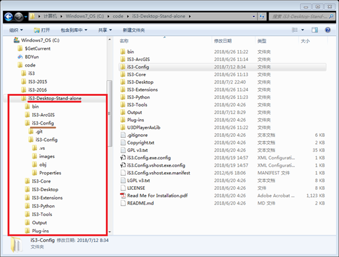

# iS3-Config

iS3单机版配置工具（iS3-Config)已经开发完毕，完美配合iS3单机版（iS3-Desktop-Stand-alone)使用，初学者再也不需要写XML配置文件和Python脚本。其中包括对数据库、2维模型、3维模型的基本操作和可视化。

## 运行要求

* .Net Framework 4.5
* You **MUST** install [Unity Webplayer](https://unity3d.com/cn/webplayer)

## 其他说明

iS3单机版源代码[下载地址](https://github.com/iS3-Project/iS3-Desktop-Standalone)

iS3单机版执行程序和Demo数据[下载地址](https://github.com/iS3-Project/iS3-Desktop-Standalone/releases)

iS3-Config单机版源代码[下载地址](https://github.com/NelsonTJ/iS3-Config)

注：请将iS3-Config源代码放到iS3-Desktop-Standalone/iS3-Config目录下编译、运行，如下图所示。

